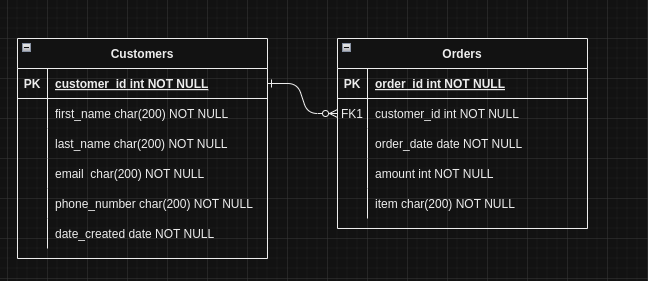

# Savannah-Informatics Assessment

## Description

This project is a dynamic web application built using Django framework, Docker, Nginx, and Ansible, deployed on an Azure virtual machine. It is a simple API service.

## Installation

To install and run this project locally, follow these steps:

1. Clone the repository: `git clone https://github.com/Okemwag/SavannahInfo-Assessment.git`
2. Navigate to the project directory: `cd SavannahInfo-Assessment`
3. Build the Docker containers: `make build`
4. Run the Docker containers: `make run`
5. Access the application in your web browser at [localhost:8000](http://localhost:8000)

## Technologies Used

- Django
- Docker
- Nginx
- Ansible
- Azure VM
